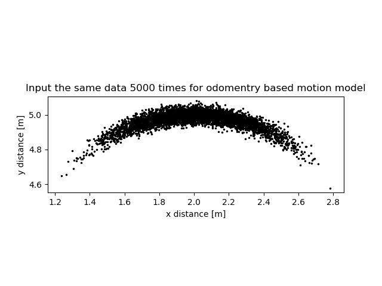

# Implementing an odometry-based motion model
a) explaining the contribution of all four terms of the noise

- `alpha1`: pure rotational uncertainty
- `alpha2`: impact of translation on both rotations
- `alpha3`: pure translational uncertainty
- `alpha4` : impact of both rotations on translation

b) I expect to get a banana-shaped distribution if I plug in many times the same input.

Results: the distribution was as expected.

 